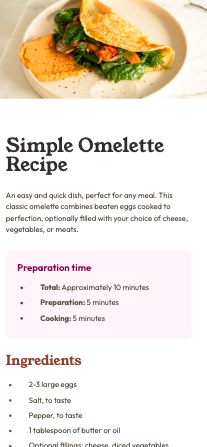
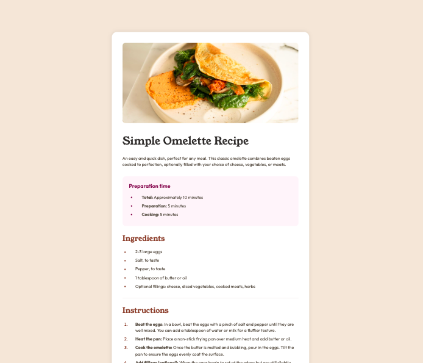

# Frontend Mentor - Recipe page solution

This is a solution to the [Recipe page challenge on Frontend Mentor](https://www.frontendmentor.io/challenges/recipe-page-KiTsR8QQKm). Frontend Mentor challenges help you improve your coding skills by building realistic projects.

## Table of contents

- [Overview](#overview)
  - [Screenshots](#screenshots)
  - [Links](#links)
- [My process](#my-process)
  - [Built with](#built-with)
  - [What I learned](#what-i-learned)
  - [Continued development](#continued-development)
  - [Useful resources](#useful-resources)
- [Author](#author)
- [Acknowledgments](#acknowledgments)

### Screenshots




### Links

- Solution URL: [Solution](https://github.com/bleubertoncodes/Frontend-Mentor-QR-code-component.git)
- Live Site URL: [Live Site](https://bleubertoncodes.github.io/Frontend-Mentor-QR-code-component/)

## My process

### Built with

- Semantic HTML5 markup
- CSS custom properties
- Flexbox

### What I learned

I learned that just becasue the design looks like it uses a table element, doesn't mean you need to use one in order to achieve the same results. In this project I instead used multiple div elements to achieve my desired outcome.

```html
<div class="protein card">
  <p class="macro">Protein</p>
  <p class="macro-amount brown">20g</p>
</div>
```

I always get stuck on how to align my footer to the very bottom of the webpage. I have seen a recuring pattern that achieving this will usually include setting amrgin to auto in some cases, while in cases such as this, I used positioning to achive my desired outcome.

```css
footer {
  position: absolute;
  display: flex;
  justify-content: center;
  bottom: 0;
}
```

### Continued development

With each new project I build, I am not only learning new techniques, but also reinforcing the fundamentals of frontend web development. I am aiming to complete one new project from Frontend Mentor each week while also continuing to learn the basics of Javascript.

## Author

- Frontend Mentor - [@bleubertoncodes.](https://www.frontendmentor.io/profile/bleubertoncodes)
- Twitter - [@bleubertoncodes](https://www.twitter.com/bleubertoncodes)
